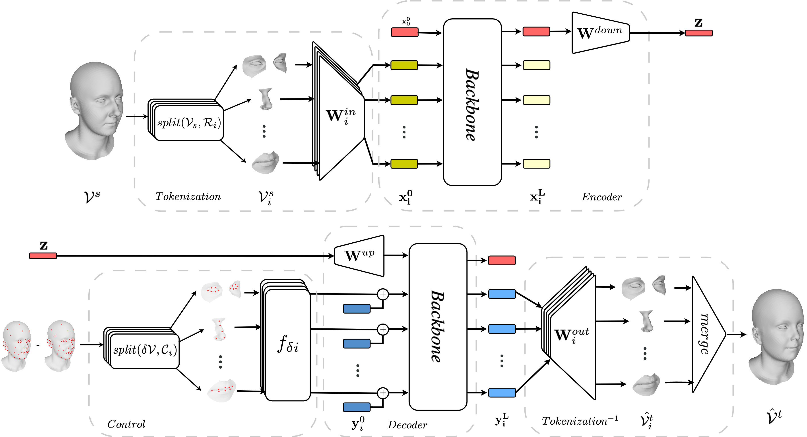

# Locally Adaptive Neural 3D Morphable Models
**[Arxiv]([tbc](https://arxiv.org/pdf/2401.02937.pdf))** 

This is the official repository for the paper 
"Locally Adaptive Neural 3D Morphable Models".  

Authors: 
[Michail Tarasiou](https://scholar.google.com/citations?user=ty8-urQAAAAJ&hl=en),
[Rolandos Alexandros Potamias](https://scholar.google.gr/citations?user=LteFCZsAAAAJ&hl=el), 
[Eimear O'Sullivan](https://scholar.google.com/citations?user=BL8Za2YAAAAJ&hl=en), 
[Stylianos Ploumpis](https://scholar.google.co.uk/citations?user=5hM4Ul4AAAAJ&hl=en), 
[Stefanos Zafeiriou](https://scholar.google.co.uk/citations?user=QKOH5iYAAAAJ&hl=en), 



## Dependencies

Before you can run this project, you need to install the necessary dependencies. These dependencies are listed in the `requirements.txt` file. Follow these steps to install them:

### Step 1: Clone the Repository

First, clone the repository to your local machine using the following command:

```bash
git clone https://github.com/michaeltrs/LAMM.git
cd LAMM
```

### Step 2: Set Up a Conda Environment (Optional)

It's recommended to create a Conda environment for managing your Python projects. This helps in keeping your project dependencies isolated and ensures that they don't conflict with other projects or the global Python installation.

Create a Conda environment by running the following command:

```bash
conda create --name LAMM python=3.8
```
Activate the Conda environment:

```bash
conda activate LAMM
```

### Step 3: Install the Dependencies

With the Conda environment activated, install the project dependencies by running:

```bash
pip install -r requirements.txt
```

### Step 4: Running the Project

After the installation of dependencies is complete, you can run the project. Follow the specific instructions provided for running the application in your project's documentation.

## Training
Modify respective .yaml config files accordingly to define model architecture, data (also modify data/currently_implemented_datasets.yaml) and save directories.

### Dimensionality Reduction (3D Mesh Reconstruction)
```bash
python train_and_eval/train_dim_reduction.py 
```

### Mesh Manipulation
```bash
python train_and_eval/train_manipulate.py 
```


## Pretrained Checkpoints
coming soon

## Blender
coming soon


